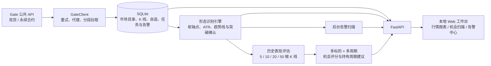
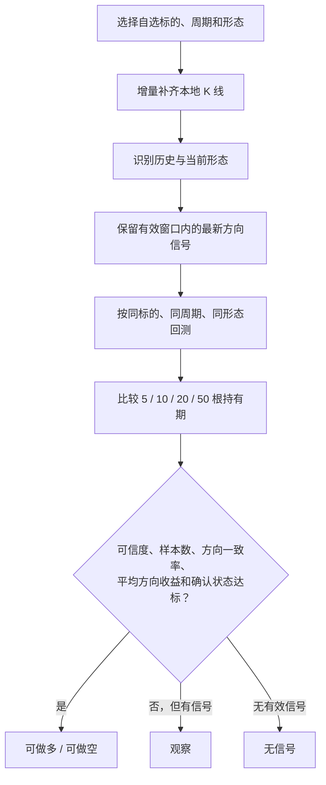
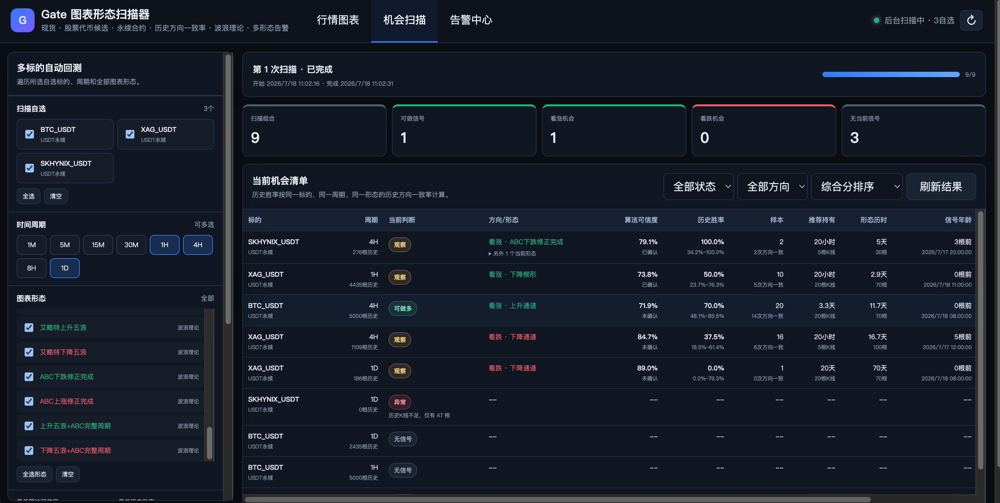
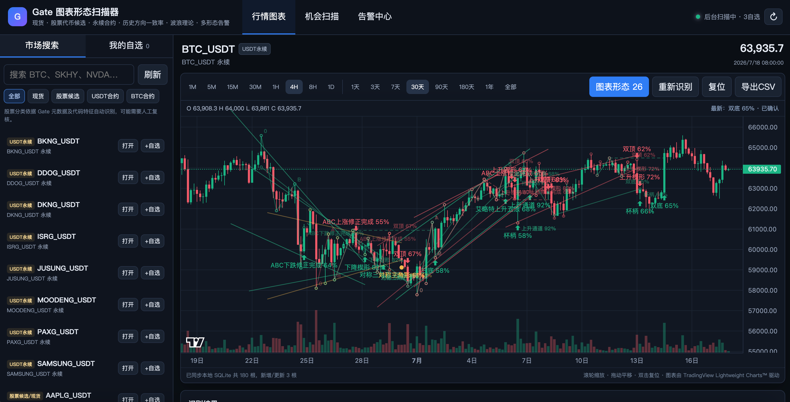
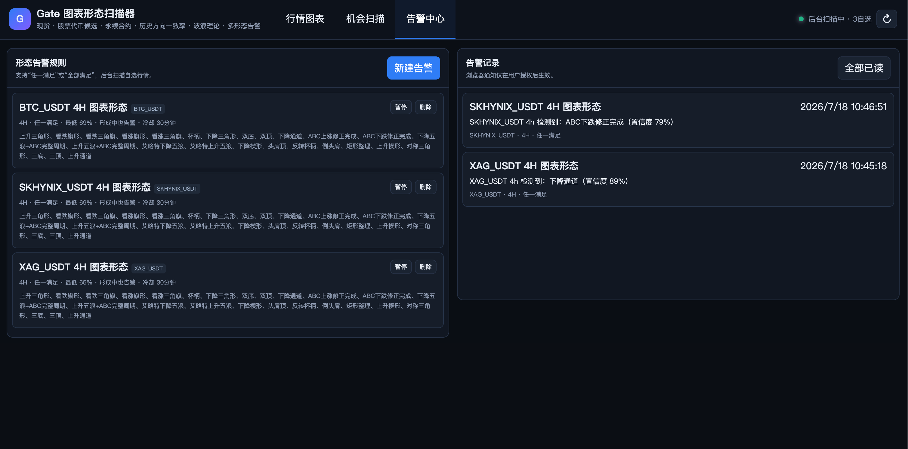
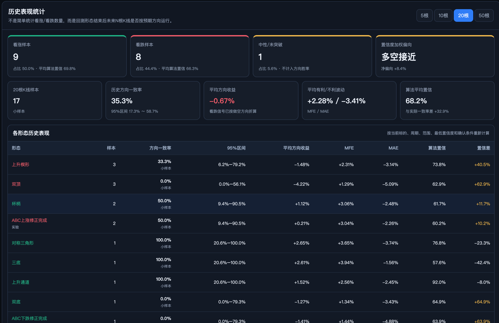

# GateScope

> Gate 市场形态研究与机会扫描工作台

GateScope 是一款本地优先的 Gate 市场研究 Web 应用。它从 Gate 公共 API 获取现货与永续合约行情，将 K 线增量缓存到 SQLite，并把图表形态识别、历史方向验证、多标的多周期机会筛选和浏览器告警整合到一个工作台中。

项目不连接账户、不读取 API Key，也不执行真实交易。所有“可做”“胜率”和“置信度”均为研究指标，不构成投资建议。

## 目录

- [核心能力](#核心能力)
- [工作原理](#工作原理)
- [支持的市场与形态](#支持的市场与形态)
- [快速开始](#快速开始)
- [使用指南](#使用指南)
- [指标口径](#指标口径)
- [配置说明](#配置说明)
- [Docker 与云端部署](#docker-与云端部署)
- [项目结构](#项目结构)
- [功能进度（Todo List）](#功能进度todo-list)
- [限制与风险提示](#限制与风险提示)

## 核心能力

- **多市场行情**：搜索 Gate 现货、USDT 永续和 BTC 永续，启发式标记股票代币候选。
- **本地 K 线仓库**：按自选标的和周期增量缓存行情，支持 CSV 导出，数据保存在本地 SQLite。
- **26 种图表形态**：覆盖反转、持续、整理、趋势及实验性的艾略特波浪形态。
- **交互式图表**：基于 TradingView Lightweight Charts™ 展示 K 线与成交量，并用 SVG 叠加形态关键点和趋势线。
- **历史方向验证**：按未来 5、10、20、50 根 K 线评估方向一致率、Wilson 置信区间、方向收益、MFE 和 MAE。
- **机会扫描**：遍历“自选标的 × 时间周期 × 形态”，结合当前信号与同条件历史表现筛选多空观察机会。
- **后台告警**：按置信度、突破状态、形态组合和冷却时间触发浏览器通知与声音。
- **本地优先**：无需前端构建工具，FastAPI、原生 JavaScript 与 SQLite 即可运行；支持 macOS、Windows 和 Docker。

## 工作原理



一次机会扫描的判断链路如下：



机会扫描会跨自选与周期执行形态回测，展示方向、形态、算法可信度、历史方向一致率、样本数、推荐持有周期、信号年龄和综合评分。

<p align="center">
  
</p>

## 支持的市场与形态

### 市场与周期

| 类型 | 范围 |
| --- | --- |
| 市场 | Gate 现货、USDT 结算永续、BTC 结算永续 |
| 股票代币 | 根据 Gate 元数据和代码特征启发式标记，仅作为候选分类 |
| K 线周期 | `1m`、`5m`、`15m`、`30m`、`1h`、`4h`、`8h`、`1d` |
| 图表范围 | 1 天、3 天、7 天、30 天、90 天、180 天、1 年、全部 |

### 图表形态

| 分类 | 形态 |
| --- | --- |
| 反转形态 | 双顶、双底、三顶、三底、头肩顶、倒头肩、杯柄、反转杯柄 |
| 持续形态 | 看涨旗形、看跌旗形、看涨三角旗、看跌三角旗 |
| 整理形态 | 上升三角形、下降三角形、对称三角形、矩形整理 |
| 趋势形态 | 上升楔形、下降楔形、上升通道、下降通道 |
| 波浪理论（实验） | 艾略特上升五浪、艾略特下降五浪、ABC 下跌修正完成、ABC 上涨修正完成、上升五浪 + ABC 完整周期、下降五浪 + ABC 完整周期 |

识别算法综合使用枢轴高低点、线性拟合、ATR、结构比例和突破确认进行启发式评分。它仅识别图表结构，不包含十字星、锤形、吞没、孕线等单根或多根 K 线组合。

### 交互式行情图表

行情工作区展示蜡烛 K 线与成交量，支持鼠标滚轮缩放、拖动平移、双击复位和 CSV 导出。识别到的形态通过 SVG 叠加层绘制，缩放和平移时会同步重绘，也可以点击识别结果定位到对应区间。

<p align="center">
  
</p>

## 快速开始

### 环境要求

- Python 3.9 或更高版本，推荐 Python 3.11 / 3.12
- 可访问 Gate 公共 API；受网络环境限制时可在 `config.json` 中配置 HTTP 或 SOCKS5 代理
- 首次加载图表时需要获取 TradingView Lightweight Charts™；程序会优先将其缓存到 `static/vendor/`

### macOS

在项目目录中执行：

```bash
chmod +x setup.command run.command
./setup.command
```

`setup.command` 会创建 `.venv`、安装依赖并启动服务。以后可直接运行：

```bash
./run.command
```

### Windows

双击 `run.bat`。脚本会在首次运行时创建虚拟环境并安装依赖。

### 通用 Python 方式

```bash
python3 -m venv .venv
source .venv/bin/activate
python -m pip install -r requirements.txt
python app.py
```

Windows PowerShell 激活虚拟环境时，将第三行替换为：

```powershell
.venv\Scripts\Activate.ps1
```

默认访问地址：<http://127.0.0.1:8777>

## 使用指南

1. **刷新市场目录**：首次启动会在后台读取 Gate 市场目录；也可在“市场搜索”中手动刷新。
2. **建立自选**：搜索并打开标的，将需要持续跟踪的标的加入“我的自选”。
3. **识别形态**：选择周期、历史范围、目标形态、最低置信度和是否仅看突破确认，然后执行识别。
4. **查看历史表现**：在 5、10、20、50 根 K 线之间切换，比较方向一致率、区间和收益指标。
5. **扫描机会**：在“机会扫描”中选择多个自选和周期，设置样本与阈值后开始遍历回测。
6. **创建告警**：在“告警中心”设置形态组合、置信度、确认条件和冷却时间，并允许浏览器通知。

### 告警中心

每条告警规则可以绑定一个自选标的、一个 K 线周期和一个或多个形态，并支持“任一形态满足”或“所有形态同时满足”。后台线程会增量更新相关 K 线、执行形态扫描并保存告警历史；前端定期读取新事件，满足条件时触发浏览器通知与声音。

<p align="center">
  
</p>

## 指标口径

### 算法置信度

算法置信度表示形态结构与启发式规则的匹配程度，不是未来盈利概率。

### 历史方向一致率

对每个历史形态，以形态结束或突破确认 K 线的收盘价为观察起点：

- 看涨形态在未来第 N 根 K 线收盘价更高，记为方向一致；
- 看跌形态在未来第 N 根 K 线收盘价更低，记为方向一致；
- 未确认方向的中性形态不进入方向一致率；
- 未来数据不足的近期形态不进入对应持有周期样本。

页面同时展示 95% Wilson 置信区间、平均方向收益、最大有利波动（MFE）和最大不利波动（MAE）。样本少于 20 次时会标记为小样本。

<p align="center">
  
</p>

### “可做”状态

默认情况下，当前信号需要同时满足以下条件：

1. 信号仍在设置的有效 K 线窗口内；
2. 算法置信度不低于阈值；
3. 同标的、同周期、同形态的历史样本数达标；
4. 推荐持有周期的历史方向一致率达标；
5. 历史平均方向收益为正；
6. 开启“仅确认”时，形态已经完成突破确认。

综合评分由算法置信度、历史证据质量和突破确认状态共同构成。它是候选信号排序，不是自动下单指令。

## 配置说明

默认配置位于 `config.json`：

```json
{
  "proxy": "http://127.0.0.1:7890",
  "host": "127.0.0.1",
  "port": 8777,
  "open_browser": true,
  "update_seconds": 15,
  "catalog_refresh_seconds": 1800,
  "default_interval": "15m",
  "default_range": "30d",
  "default_watch_refresh_seconds": 15,
  "max_pattern_bars": 5000
}
```

常见代理配置：

```json
{
  "proxy": "http://127.0.0.1:7890"
}
```

```json
{
  "proxy": "socks5h://127.0.0.1:7890"
}
```

不使用代理时设为空字符串：

```json
{
  "proxy": ""
}
```

修改配置后需要重启服务。为保证历史表现样本量，`max_pattern_bars` 在运行时最低按 5000 根使用。

也可以用环境变量覆盖监听设置：

| 环境变量 | 作用 |
| --- | --- |
| `HOST` | 服务监听地址 |
| `PORT` | 服务端口 |
| `NO_BROWSER=1` | 启动后不自动打开浏览器 |

## 本地数据

默认数据库路径为 `data/gate_patterns.db`，保存以下内容：

- Gate 交易标的目录
- 自选列表和 K 线缓存
- 告警规则和告警历史
- 机会扫描设置、运行记录与任务状态
- 当前机会明细和历史回测摘要

删除数据库会清空以上本地数据。运行中的 SQLite 还可能生成 `-wal` 和 `-shm` 文件；备份时应先停止服务，或使用 SQLite 的一致性备份方式。

## Docker 与云端部署

### Docker Compose

```bash
docker compose up -d --build
```

启动后访问 <http://127.0.0.1:8777>，`./data` 会挂载到容器的 `/app/data`。

> Docker 容器内的 `127.0.0.1:7890` 指向容器自身。macOS / Windows Docker Desktop 可尝试 `http://host.docker.internal:7890`；云端部署通常应清空本地代理设置。

### Render 或其他容器平台

仓库提供 `render.yaml`。云端运行时应注意：

- GitHub Pages 只能托管静态文件，不能运行 FastAPI 和 SQLite；
- SQLite 需要持久磁盘，否则重启或重新部署可能丢失数据；
- 多实例部署不适合直接共享单个 SQLite 文件，需改用外部数据库或保持单实例；
- 应将 `HOST` 设为 `0.0.0.0`，并由平台注入 `PORT`。

## 项目结构

```text
gate_scanner/
├── app.py                  # FastAPI 接口、静态站点入口和进程启动
├── gate_client.py          # Gate 公共 API、代理、重试与分段拉取
├── database.py             # SQLite 表结构与数据访问层
├── pattern_engine.py       # 图表形态识别与历史表现统计
├── scanner.py              # 自选行情更新与形态告警后台线程
├── opportunity_scanner.py  # 多标的、多周期扫描与持有期评估
├── static/
│   ├── index.html          # 工作台页面
│   ├── app.js              # 交互、图表和接口调用
│   ├── styles.css          # 页面样式
│   └── vendor/             # 本地缓存的 Lightweight Charts
├── data/                   # SQLite 数据文件
├── config.json             # 本地运行配置
├── requirements.txt        # Python 依赖
├── setup.command           # macOS 首次安装与启动
├── run.command             # macOS 日常启动
├── run.bat                 # Windows 安装与启动
├── Dockerfile
├── docker-compose.yml
└── render.yaml
```

## 技术栈

- **后端**：Python、FastAPI、Uvicorn
- **数据与计算**：SQLite、Pandas、NumPy
- **行情来源**：Gate API v4 公共市场接口
- **前端**：HTML、CSS、原生 JavaScript
- **图表**：TradingView Lightweight Charts™ 5.2.0

第三方组件说明见 [THIRD_PARTY_NOTICES.md](./THIRD_PARTY_NOTICES.md)。

## 功能进度（Todo List）

### 已完成

- [x] Gate 现货、USDT 永续和 BTC 永续市场目录搜索
- [x] 多周期 K 线获取、SQLite 增量缓存与 CSV 导出
- [x] TradingView 风格 K 线、成交量和图表形态叠加展示
- [x] 26 种反转、持续、整理、趋势和实验性波浪形态识别
- [x] 算法置信度、突破确认和历史形态定位
- [x] 未来 5、10、20、50 根 K 线方向一致率统计
- [x] Wilson 置信区间、平均方向收益、MFE 和 MAE 评估
- [x] 多标的、多周期机会扫描与候选信号排序
- [x] 推荐观察周期、信号年龄和综合评分
- [x] 自选行情后台更新与图表形态告警
- [x] 浏览器通知、声音提醒和告警历史
- [x] macOS、Windows、Docker 和 Render 部署支持

### 待办

- [ ] **用户登录机制**：加入用户注册、登录、会话管理和数据隔离，为多用户部署提供基础。
- [ ] **系统配置设置**：提供可视化配置页面，统一管理网络代理、数据刷新频率、扫描任务、默认阈值和通知选项。
- [ ] **完整回测系统**：在现有形态方向统计之外，支持策略规则、进出场条件、手续费、滑点、资金费率、权益曲线和回测报告。
- [ ] **接口开仓机制**：接入 Gate 私有交易接口，支持模拟盘验证、授权控制、仓位限制、止盈止损、审计日志和紧急停用。该功能默认关闭，并在完善安全与风控后提供。

## 限制与风险提示

1. Gate 对过早的细周期历史 K 线有限制；程序会保留本地缓存并持续积累新数据，但无法凭空恢复 API 不再提供的数据。
2. 股票代币候选是启发式分类，可能存在误判或遗漏。
3. 形态识别和波浪划分具有主观性，实验性波浪算法尤其需要人工复核。
4. 样本内回测存在过拟合、样本重叠和市场状态变化风险，历史方向一致率不能外推为未来胜率。
5. 实盘还会受到流动性、手续费、滑点、资金费率、延迟和风险控制影响，本项目未模拟全部因素。
6. 项目不包含交易所账户接入、仓位管理或真实下单功能。
